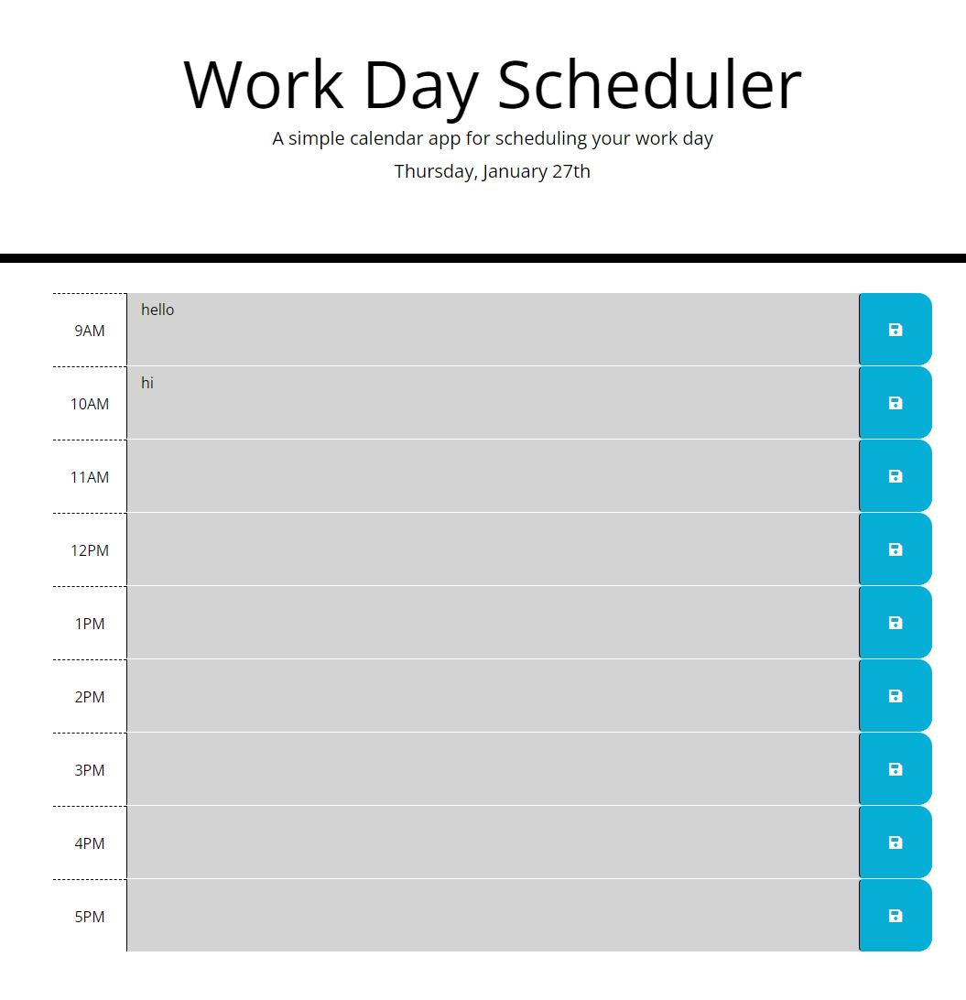

# DayPlanner

## Description
Day Planner is a calendar app that allows the user to enter events for time blocks and save events.

## Usage
Use a text editor to clone down the repository, then open the HTML file in your browser.

## Screenshots

